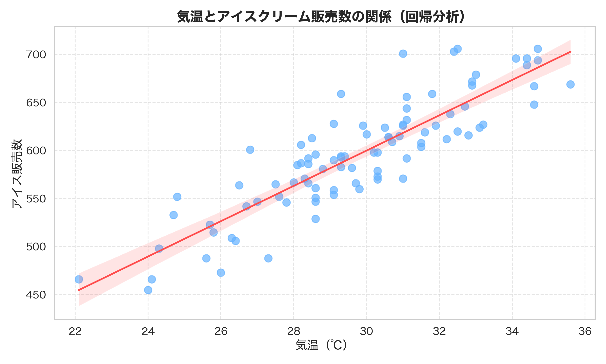

# 🍦 気温とアイスクリーム販売数の関係分析

このプロジェクトは、東京における気温とアイスクリームの販売数の関係性をデータ分析と可視化を通じて明らかにするものです。

## 🔍 分析テーマ

- 気温が高くなるとアイスクリームの売上は増えるのか？
- 日別の販売傾向を把握し、販売戦略に活かせるか？

## 🧰 使用技術

- Python（pandas, matplotlib, seaborn）
- Jupyter Notebook
- Git / GitHub

## 📊 可視化（一部抜粋）

### 気温とアイス販売数の回帰分析

> 赤い線は回帰直線を示しており、気温の上昇に伴って販売数が増加する傾向が見られます。

## 📁 フォルダ構成

